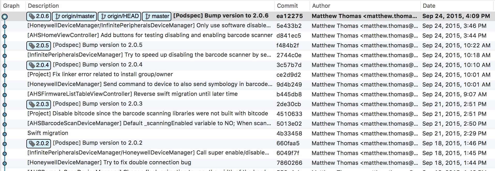

#Creating a CocoaPod

Developers can create and distribute their own CocoaPods and distribute them in a number of ways both privately and publicly. This page will go over how to create a basic CocoaPod.

Each CocoaPod requires a Podspec configuration and a license file. A Podspec is a Ruby document that describes details about a specific version of a CocoaPod, including where the source code should be downloaded from, what files to use, the build settings to apply, and *"other general metadata such as its name, version, and description"*.

##Create a Podspec

You can generate a Podspec by running the following command at the terminal:

```pod spec create [Name-of-Pod]```

This command will generate a Podspec stub (Name-of-Pod.podspec) which can be filled out with the specifics of your CocoaPod.  

```
Pod::Spec.new do |s|
  s.name             = "MyPod"
  s.version          = "0.1.0"
  s.summary          = "A short description of MyPod."

  s.description      = <<-DESC
  The description goes here between the DESC delimiters. The description should be short and to-the-point and focus on the purpose of the library.
                       DESC

  s.homepage         = "https://github.com/<GITHUB_USERNAME>/MyPod"
  # s.screenshots     = "www.example.com/screenshots_1", "www.example.com/screenshots_2"
  s.license          = 'MIT'
  s.author           = { "[NAME]" => "your@email.com" }
  s.source           = { :git => "https://github.com/<GITHUB_USERNAME>/MyPod.git", :tag => s.version.to_s }
  # s.social_media_url = 'https://twitter.com/<TWITTER_USERNAME>'

  s.platform     = :ios, '8.0'
  s.requires_arc = true

  s.source_files = 'Pod/Classes/**/*'
  s.resource_bundles = {
    'MyPod' => ['Pod/Assets/*.png']
  }

  # s.public_header_files = 'Pod/Classes/**/*.h'
  # s.frameworks = 'UIKit', 'MapKit'
  # s.dependency 'AFNetworking', '~> 2.3'
end
```

##Bootstrapping the Pod Creation Process

There is a powerful new and simpler method of creating a Pod which also assists in creating a demo app within which to develop your library and optionally pre-integrating both a test framework ([Quick/Nimble](https://github.com/Quick/Quick)) and a view based test framework ([FBSnapshotTestCase](https://github.com/facebook/ios-snapshot-test-case) from Facebook).

Simply run the following command at the terminal:  

```$ pod lib create```

...and follow the on-screen instructions. For more information about this process, see [https://guides.cocoapods.org/making/using-pod-lib-create.html](https://guides.cocoapods.org/making/using-pod-lib-create.html)

##Next Steps
After you have created your Podspec and added your source files, make sure that your library is under version control and is using [Semantic Versioning](http://semver.org) to tag the commit of each release. That way consumers of your library can count on backwards compatibility when use the 'optimistic' operators in their Podfile.



##Advanced Features
To learn more about the advanced features of a Podspec see the official [Podspec syntax](http://guides.cocoapods.org/syntax/podspec.html).

**Previous**: [Challenges with Cocoapods](cocoapod-challenges.md)  
**Next Up**: [CocoaPod Distribution](distributing-pods.md)  
...or return to the [homepage](README.md).
