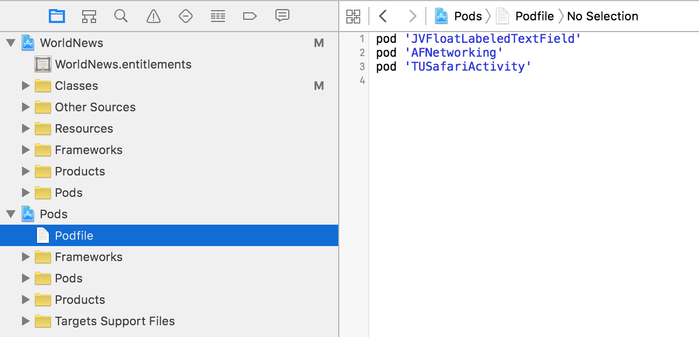

#Integrating Pods

##Create a Podfile
At the terminal, <code>cd</code> into the root directory of your project. You will need to create a file called **'Podfile'** (with no file-type extension).  

You can do this manually:  
    ```$ touch Podfile```  

...or by asking CocoaPods to do it for you:  

    ```$ pod init```  

The Podfile is a Ruby document which tells Cocoapods which libraries your project wants to use. It describes the dependencies of the target(s) of your project.  

##Target Platform
Open the Podfile in text edit or Xcode, and begin by adding the target platform on the first line. This will be used to ensure that the dependencies are compatible.  

For a project targeting iOS, this would be:  
```platform :ios, '8.0'```

For a project targeting OS X, this woudl be:
```platform :osx, '10.11'```

If you'd like to support multiple platforms, then you might write something like this:

```
target :ios do
    platform :ios, '7.0'
    pod 'RestKit'
end

target :osx do
    platform :osx, '10.10'
    pod 'RestKit'
end
```

Next you can begin adding project dependencies.

##Adding Dependencies
Once you've [found](searching-for-cocoapods.md) a CocoaPod you'd like to integrate, add it to the Podfile using its name.

*Integrate the latest version of RestKit*  
```pod 'RestKit'```  

The Podfile can have many dependencies. Each pod should be placed on its own line.

###Dependency versions

If your projects depends on a specific version of a CocoaPod, the Podfile can be used to restrict integration of the CocoaPod to that version.

*Integrate the version 0.25.0 of RestKit*  
```pod 'RestKit', '0.25.0'```

Logic operators can be used to assign minimum or maximum supported versions.

*Integrate the latest version of RestKit that is greater than 0.22.0*  
```pod 'RestKit', '>= 0.22.0'```  

Podfile supports the use of an 'optimistic operator' to allow only the last version component to increment.

*Integrate any version of RestKit from 0.2.1 up to (but not including) 0.3*  
```pod 'RestKit', '~> 0.2.1'```

If a the Pod conforms to [Semantic Versioning](https://github.com/mattbocosoft/presentation-gitflow-and-semanticversioning), using the 'optimistic operator' to allow the minor and patch version to increment, but not the major version, is a good way to ensure that the project integrates the latest version the dependency that maintains backwards compatibility.

If you want to use the latest commit of a CocoaPod, you can use the :head flag.

```pod 'GoogleAnalytics', :head```

####Referencing a Podspec

If you want to use a library which doesn't include a Podspec, but someone else has created a Podspec for it, then you can reference the location of the Podspec:  

```pod '[PODNAME]', :podspec => 'https://example.com/[PODNAME].podspec'```

####Build Configuration

You can install CocoaPods per build configuration. For example, if you want to install PonyDebugger only on the debug configuration, then you can do this:  

```pod 'PonyDebugger', :configurations => ['Debug']```

This is a new but popular feature and may change without notice in the future.

####Example

Here is an example of how your Podfile might look if your project targets iOS 7 and needs to use two libraries; AFNetworking and NSDate+TimeAgo:  

```
platform :ios, "7.0"

pod "AFNetworking"
pod 'NSDate+TimeAgo'
```  

For more information about the Podfile, consult the CocoaPods official documentation here: [https://guides.cocoapods.org/syntax/podfile.html](https://guides.cocoapods.org/syntax/podfile.html)  

##Installing Dependencies
Now that you have a **'Podfile'** in place and added the project dependencies, head back to the terminal and run the installation command within the root directory of the project:  

```pod install```

This command will generate a new workspace file by default, fetch the CocoaPod dependencies' source code and integrate them directly into the the workspace. The ```pod install``` command also takes care of all project settings like linker flags, search paths, and headers. This command will create a folder called 'Pods' where the Pod code resides, as well as a file Podfile.lock which tracks the current version of the Pods installed.

From now on, you use the workspace file to open up your project, so close your project file if you have it open. When you open up the workspace file in Xcode, you should now see two sub-projects in the workspace. Expand the **Pods** project to reveal that the **'Podfile'** has been referenced.



####Sub-projects

CocoaPods allows you to use a project file with subprojects instead of a workspace file by specifying the ```--no-integrate``` flag when running the pod install command.

####Target Build Settings

When the new workspace/project is created, CocoaPods will base your project off of the Pods configuration file. Be careful when modifying the build settings to not completely override the CocoaPod configuration. CocoaPods documentation requests, "to add values to options from your project’s build settings, prepend the value list with $(inherited)." This is especially important with the library and header search paths and other linker flags.

####Behind the Scenes

Here is how the CocoaPods documentation explains what is happening behind the scenes:  

```
1. Creates or updates a workspace.  
2. Adds your project to the workspace if needed.  
3. Adds the CocoaPods static library project to the workspace if needed.  
4. Adds libPods.a to: targets => build phases => link with libraries.  
5. Adds the CocoaPods Xcode configuration file to your app’s project.  
6. Changes your app's target configurations to be based on CocoaPods's.  
7. Adds a build phase to copy resources from any pods you installed to your app bundle. i.e. a ‘Script build phase’ after all other build phases with the following:  
  * Shell: /bin/sh
  * Script: ${SRCROOT}/Pods/PodsResources.sh
```
> Source: [https://guides.cocoapods.org/using/using-cocoapods.html](https://guides.cocoapods.org/using/using-cocoapods.html)


##Dependencies in Version Control
Depending on your needs, you can choose to checkin or exclude your Pod dependencies from source control. While CocoaPods officially recommends that you checkin your Pods to source control, there are advantages to both methods.

####Check-in Pods to Source Control
+ When another developer downloads your code, it will run as is without any need to install CocoaPods or run 'pod install'  
+ If the Pod dependencies are removed or their online location changes, it will not affect your project until you want to update your Pods  

####Excluding Pods from Source Control
+ Smaller project repository footprint
+ Easily recreate the Pods as long as they are still available

If you do chose to exclude your Pods from source control, simply add the 'Pods' directory to the .gitignore file.

##Updating Dependencies
You can update your CocoaPod dependencies following the version rules specified in the Podfile by running ```pod update```. This command will check the master CocoaPod Podspec repository, and any custom Podspec respositories you may have specified, for any updates to your dependencies, download them, and install them in your workspace.

If you'd like to update only a specific Pod without touching the others currently installed, then you can run:

```$ pod update [POD_NAME]```

##Uninstalling Dependencies
To remove a dependency, simply delete the associated line in the Podfile and run ```pod install``` again. CocoaPods should remove all references and files associated with that Pod.

**Previous**: [Searching for pods](searching-for-cocoapods.md)  
**Next Up**: [Challenges with CocoaPods](cocoapod-challenges.md)  
...or return to the [homepage](README.md).
