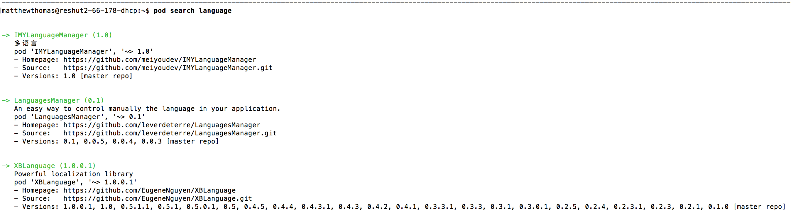

#Searching for CocoaPods

There are (*as of October 2015*) more than 12,000 CocoaPods publicly available. Each CocoaPod is registered via a Podspec, which is a specification that describes a version of a CocoaPod. Here is the official repository of Podspecs: https://github.com/CocoaPods/Specs/tree/master/Specs

Below are a variety of options to help search for and discover CocoaPods.

##"pod search" command
In the terminal, type <code>'pod search \<query\>'</code> where \<query\> represents the keyword(s) you are searching for.

Use <code>pod search --help</code> for more information.

##CocoaPods Homepage
The [CocoaPods homepage](https://cocoapods.org) offers a search field to look for CocoaPods by name, version, author, keywords, summary or dependencies.

##CocoaPod RSS Feed
CocoaPods.org offers an RSS Feed to "never miss a pod again!" Subscribe to [https://feeds.cocoapods.org/new-pods.rss](https://feeds.cocoapods.org/new-pods.rss).

##Keep an eye out for Podspecs
CocoaPods is fast becoming the standard method for Cocoa Dependency Management, so most popular libraries support CocoaPods. Look for a Podspec in the root directory of the library or a note about CocoaPod installation in the readme.

##Other sources
Additionally, there are some 3rd-party resources which can help you sift through the almost 12,000 CocoaPods currently available.

* [What the Pod: A ranked list of the most popular CocoaPods](http://www.whatthepod.com)  
* [Search CocoaPods @ Wantedly](http://cocoapods.wantedly.com)  
* [Trending CocoaPods](http://trendingcocoapods.github.io)

**Previous**: [Installing CocoaPods](install-cocoapods.md)  
**Next Up**: [Integrating pods](integrating-pods.md)  
...or return to the [homepage](README.md).
